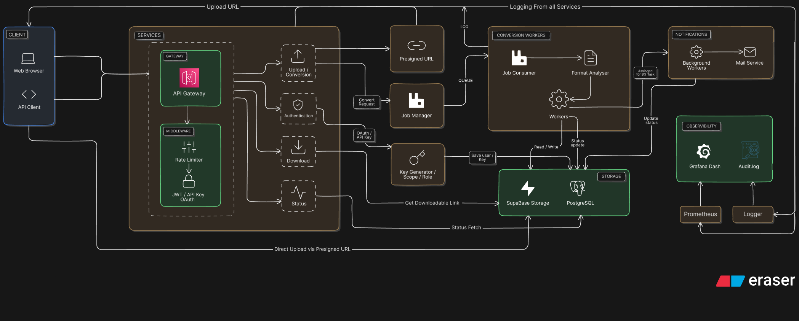

<p align="center" style="display: flex; align-items: center; justify-content: center; gap: 10px;">
  
  
    
</p>
<p align="center">
A scalable document processing API for developers.
</p>

#  DocConvert

> **A scalable document conversion platform built on microservices — upload, convert, and download documents through secure, async APIs.**

---
### ⚒ Architecture

[](https://github.com/charantm7/Chat-Hub)

---

## ✨ Features

**Security**
- JWT, API Keys, OAuth2
- Scope-based and role-based access control

**Platform**
- Rate limiting per user plan, API key, and role
- RabbitMQ-based async processing
- S3-compatible object storage
- Prometheus metrics and structured logging

**Document Tools**
- PDF → Word
- PDF → PowerPoint
- Compress PDF
- Merge / Split PDF
- Protect / Unlock PDF
- Rotate / Remove Pages
- PDF → Image

**Developer API**
REST API for integrating document conversion into applications.

---

## 🛠️ Tech Stack

| Layer | Technology |
|-------|-----------|
| Backend | Python, FastAPI |
| Queue | RabbitMQ |
| Storage | Supabase Storage |
| Auth | JWT, OAuth2, API Keys |
| Database | PostgreSQL, SQLAlchemy |
| Tools | Alembic, Pydantic, pdf2docx, pypdf |
| DevOps | Docker, Docker Compose, Prometheus, Grafana |

---

## 🚀 Getting Started

**Prerequisites:** Docker, Docker Compose

```bash
git clone https://github.com/charantm7/docconvert-platform.git
cd docconvert-platform
docker compose up --build
```

This starts all services: API Gateway, Upload, Conversion Workers, RabbitMQ, PostgreSQL, and Prometheus.

---

## 🖧 Services

| Service | Responsibility |
|---------|---------------|
| `api_gateway` | Entry point — auth & rate limiting |
| `upload_service` | Accepts and stores uploaded documents |
| `conversion_workers` | Processes conversion jobs from queue |
| `status_service` | Tracks and exposes job progress |
| `download_service` | Serves converted files |

---

## 💡 How It Works

1. User uploads a document → stored in S3
2. Conversion job published to RabbitMQ
3. Worker picks up job, converts the file, saves result to S3
4. Status service updates job state in PostgreSQL
5. User polls status and downloads the converted file

---

## 👀 Monitoring

Prometheus is preconfigured via `prometheus.yml`. Extend with Grafana and Alertmanager as needed.

---

## 🗺️ Roadmap

- [ ] Web dashboard
- [ ] Additional format support
- [ ] Worker autoscaling
- [ ] Webhooks for job completion
- [ ] Grafana dashboards
- [ ] Multi-tenant support

---

## 🤝 Contributing

```bash
# 1. Fork the repo
# 2. Create a feature branch
git checkout -b feature/your-feature
# 3. Commit and push
git commit -m "add: your feature"
git push origin feature/your-feature
# 4. Open a Pull Request
```

---

## License

MIT © [Charan TM](https://github.com/charantm7)
